# Owayo Database Reconstruction & SQL Analytics Project

This project was developed as part of a **Database Systems course** in the Industrial Engineering and Management program at **Ben-Gurion University**.

The project was completed by a team of three students and focuses on analyzing the structure and business processes of the sports apparel website **Owayo**.

https://www.owayo.com/

Owayo is a German company specializing in customizable sports clothing. The company allows athletes and sports teams to design and order personalized sports apparel through an online platform that includes advanced customization tools and an integrated ordering system.

Our goal in this project was to **reconstruct the database infrastructure behind such a platform from scratch**, using the concepts learned during the course. Starting from an analysis of the website and its business processes, we designed a relational database that models the core operations of the platform.

The system we designed simulates the backend data structure required to support an e-commerce platform for customizable sports products. The project includes the complete lifecycle of a data system:

- business process analysis
- conceptual database design
- relational schema implementation
- SQL analytics
- data integrity enforcement
- business intelligence dashboards

The database stores and analyzes information about customers, products, designs, orders, reviews, and shopping carts in order to generate meaningful insights about customer behavior and product performance.

---

# The Website We Modeled

The Owayo platform enables customers to design custom sports apparel and order it directly through the website.

The typical business flow on the platform includes:

1. The customer selects a sport category.
2. The customer designs a customized product.
3. The design is added to a shopping cart.
4. The customer provides shipping and payment information.
5. The order is processed and delivered.

The database designed in this project models each stage of this process and captures the relationships between customers, products, designs, orders, and shipping information.

---

# Project Goals

The main goals of the project were:

- to analyze a real website and understand its business processes
- to design a relational database architecture from scratch
- to enforce data integrity using constraints and relationships
- to implement analytical SQL queries for business insights
- to identify patterns in customer behavior and product performance
- to build Power BI dashboards for decision support

The system simulates realistic data in order to analyze purchasing behavior, product ratings, and potential reseller activity.

---

# Database Architecture

The system is designed as a relational database composed of several main entities including:

- Customers
- User Accounts
- Addresses
- Shopping Carts
- Orders
- Products
- Designs
- Reviews
- Product Rosters

Relationships between these entities are enforced using **primary keys, foreign keys, and relational constraints** to ensure consistency and prevent invalid data.

Entity Relationship Diagram:

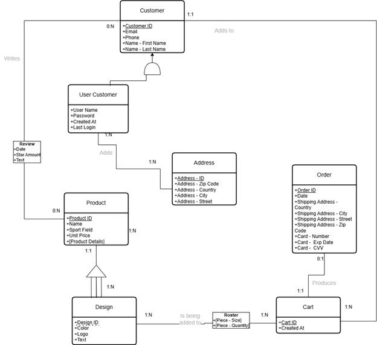

---

# Data Integrity and Constraints

Several mechanisms were implemented to ensure the reliability of the data stored in the database.

Foreign keys enforce relationships between tables such as:

- Orders and Carts
- Rosters and Designs
- Products and Sport Categories
- Reviews and Products

Additional check constraints validate different types of input, including:

- phone number format
- email format
- positive quantities for ordered products
- valid payment information

These constraints help prevent inconsistent or incorrect records from entering the database.

---

# SQL Analytical Queries

The project includes several analytical SQL queries designed to answer business questions about the platform.

Examples include:

- identifying the sport categories generating the highest revenue
- detecting high-value customers based on their order history
- identifying products with ratings below the average of their category

Example query output:

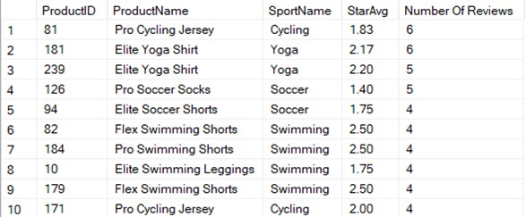

---

# Window Functions

Window functions were used to analyze sales performance over time.

These queries calculate:

- monthly revenue
- revenue compared with the previous month
- rolling three-month revenue averages

This allows identifying growth trends and seasonal patterns in sales.

---

# Common Table Expressions (CTE)

CTEs were used to build multi-stage analytical queries.

One example identifies **VIP customers** by:

1. calculating the value of each order
2. computing the average order value
3. identifying customers with above-average purchases
4. determining which countries contain the highest concentration of VIP customers

Example output:

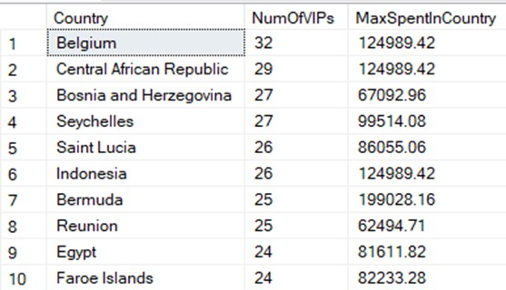

---

# SQL Views

Several views were created to simplify complex analytical queries.

Examples include:

Customer Order Details  
A view combining customers, products, orders, and shipping addresses to simplify purchase analysis.

Abandoned Cart Detection  
A view identifying carts that were created but never converted into orders.

Suspicious Reseller Summary  
A view aggregating customer activity to identify unusual purchasing patterns.

---

# SQL Functions

Custom SQL functions were implemented to support deeper analysis.

Saved Address Usage Function  
Calculates how often customers use their saved addresses when placing orders.

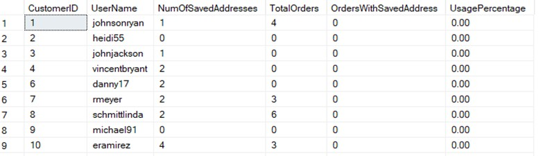

Suspicious Reseller Detection Function  
Detects customers who order across many sport categories or purchase unusually large numbers of products.

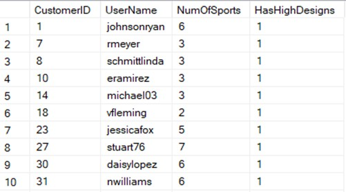

---

# Trigger Implementation

A trigger was implemented to ensure the reliability of product reviews.

Users are only allowed to submit a review if they have actually purchased the product. If a review is inserted for a product that was never purchased by that user, the trigger automatically removes the review.

This ensures that the review system reflects genuine customer feedback.

---

# Stored Procedure

A stored procedure was implemented to clean abandoned shopping carts.

The procedure removes:

- carts that contain no items
- carts that contain items but were never converted into orders

Before cleanup:

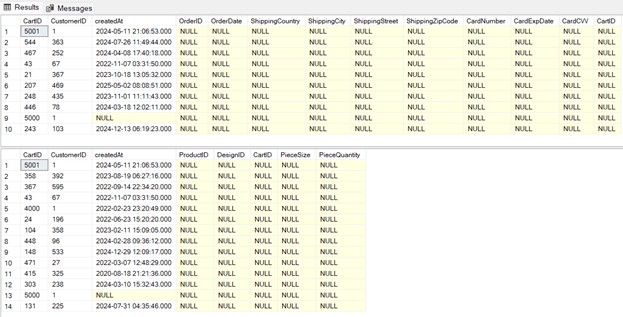

After cleanup:

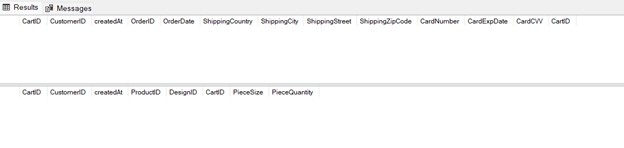

---

# Business Intelligence Dashboard

Power BI dashboards were created to transform the SQL database into an interactive analytics environment.  
The goal of the dashboards is to allow users to explore sales activity, customer behavior, and product performance through visual analysis.

The dashboards were built directly on top of the SQL queries and views implemented in the database layer, enabling real-time exploration of the data.

The BI layer focuses on four main analytical areas:

- revenue trends over time  
- sales distribution across sport categories  
- product performance by type  
- detection of potential reseller activity  

---

## Revenue Overview Dashboard

This dashboard provides a high-level overview of the platform’s sales performance.

Key indicators displayed at the top include:

- **Total Revenue**
- **Top Sport Category**
- **Total Orders**

The dashboard also includes filters that allow users to analyze sales by:

- year
- month
- sport category
- product type

The central visualization shows **revenue distribution by sport category across time**, allowing analysts to identify which sports generate the most revenue and how sales evolve over time.

---

## Yearly Revenue Analysis

This dashboard analyzes revenue trends over multiple years and shows how demand changes over time.

The stacked bar chart displays **annual revenue broken down by sport category**, enabling comparisons between sports such as:

- Basketball
- Cycling
- Esports
- Running
- Soccer
- Swimming
- Yoga

The table beneath the chart provides a detailed breakdown of revenue by **product type**, including hoodies, jerseys, leggings, shirts, shorts, socks, and tank tops.

This view allows analysts to identify:

- long-term revenue growth
- the most profitable sport categories
- product types that generate the highest revenue

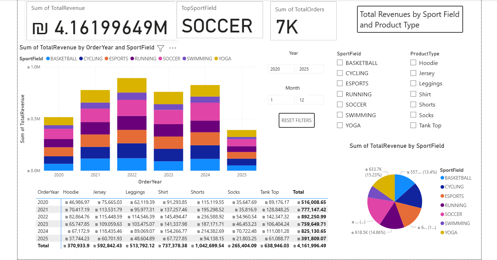

---

## Quarterly Revenue Trends

The quarterly dashboard focuses on **shorter-term trends** and helps detect seasonal patterns.

By analyzing revenue by quarter, it becomes possible to identify:

- seasonal demand patterns
- periods of high sales activity
- sports that dominate during certain seasons

This level of aggregation provides a clearer view of how demand evolves within a year.

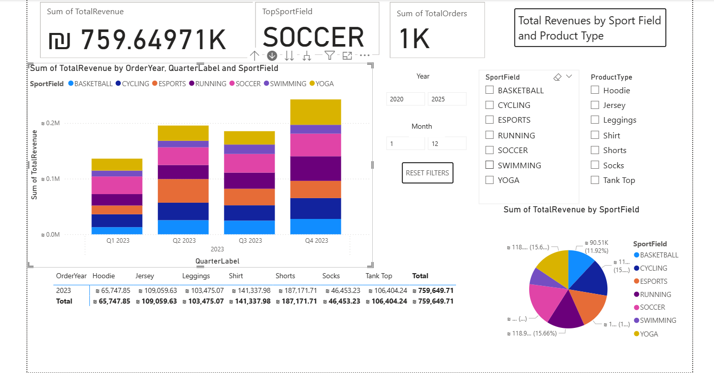

---

## Monthly Revenue Analysis

The monthly dashboard provides a more granular view of revenue patterns.

It allows analysts to observe fluctuations in sales across individual months and evaluate how sport categories contribute to monthly revenue totals.

This view is useful for identifying:

- promotional effects
- mid-season sales increases
- sport-specific purchasing patterns

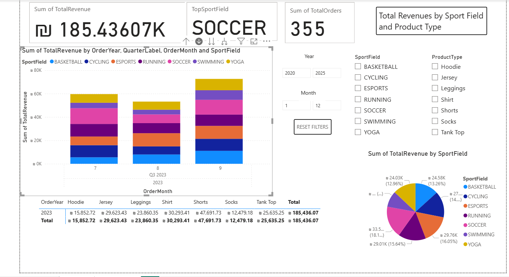

---

## Daily Sales Activity

The daily dashboard provides the most detailed view of revenue activity.

By analyzing revenue at the **daily level**, it becomes possible to detect:

- sudden spikes in purchases
- short-term promotional effects
- abnormal sales behavior

This level of detail is particularly useful for identifying unusual purchasing patterns.

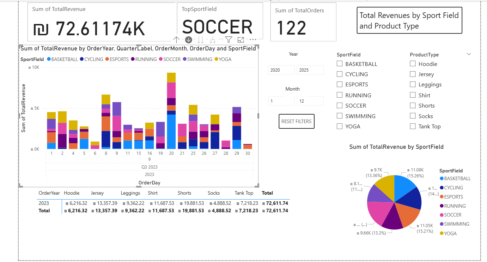

---

## Reseller Detection Report

One of the most advanced dashboards in the project focuses on **identifying potential product resellers**.

The assumption behind this analysis is that customers who purchase products across **many different sport categories and designs** may be purchasing items for resale rather than personal use.

The dashboard analyzes customer behavior using several indicators:

- number of sport categories ordered
- number of unique product designs purchased
- total number of items ordered
- total revenue generated by the customer
- date of last purchase

Customers are displayed in a summary table and can be filtered using thresholds such as:

- minimum number of sport categories ordered
- minimum number of unique designs purchased
- minimum total revenue

A heatmap visualization shows the distribution of customers according to their **order diversity**, making it easier to detect clusters of unusual purchasing behavior.

This report demonstrates how data analysis can be used to identify potential resellers and unusual market behavior.

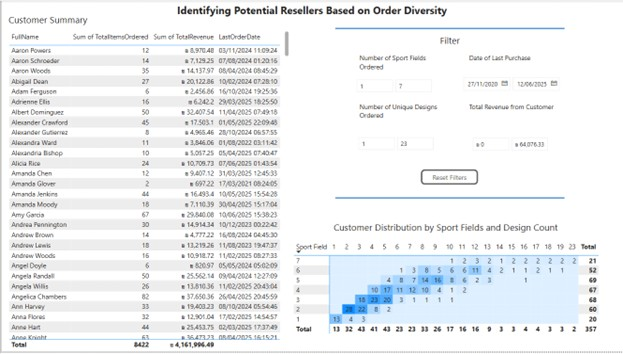

---

Together, these dashboards demonstrate how a structured relational database can be transformed into an **interactive analytics platform**, enabling both operational monitoring and strategic decision-making.
---

# Repository Structure

```
inventory-management-sql-bi

sql
01_build_database.sql
02_business_queries_and_analytics.sql

data
sample_data.xlsx

powerbi
inventory_analytics_dashboard.pbix

screenshots

docs
project_part1_business_analysis.docx
project_part2_database_design.docx
project_part3_sql_bi.docx
```

---

# Technologies Used

Microsoft SQL Server  
T-SQL  
Power BI  
Relational Database Design  
Business Intelligence Analytics  

---

# How to Run the Project

Open SQL Server Management Studio.

Run the database creation script:

sql/01_build_database.sql

This script creates the entire database schema and all constraints.

Import the dataset from:

data/sample_data.xlsx

Run the analytical queries:

sql/02_business_queries_and_analytics.sql

Finally open the Power BI dashboard:

powerbi/inventory_analytics_dashboard.pbix

---

# Authors
Roi Laniado
Dana Gorodesky
Yoav Nesher  
Industrial Engineering and Management  
Ben-Gurion University
